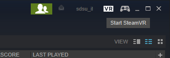
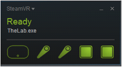

# Setting Up the Room

## Launching Steam

Steam is the application that houses all of the virtual reality applications

1\) Double-click the Steam icon found on the Desktop

NOTE: Steam may ask for the login credentials. In this case, contact Staff Member to login.

Click on the VR button in the top right corner of Steam to bring up the VR Applet, which help you prepare your input devices.

## Preparing the Input Devices

There are 5 key components to the VIVE:

* The Head Mounted Display \(Head Unit\)
* The Hand Controllers \(One for your Left and Right Hand\)
* The Two Ceiling Mounted Base Stations \(Lighthouses\)

The Head Unit will automatically turn on when you load a VR Application, or open the SteamVR applet. However, you will need to turn on each of the hand controllers. This can be done by pressing the concave button underneath the large circular trackpad on each controller. The button has an icon of two stacked squares.

Each controller will emit an audible tone, similar to the Mario Coin chime, when they are connected and ready.

Once the SteamVR applet opens, you should see the the following status window:

If all the components are Green, you are ready to go. If one or more of the devices are not ready, move to the [Troubleshooting](troubleshooting.md) section.

